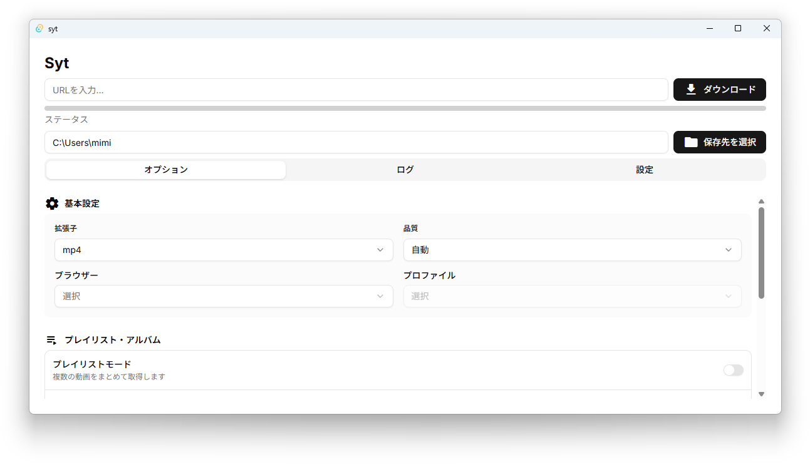
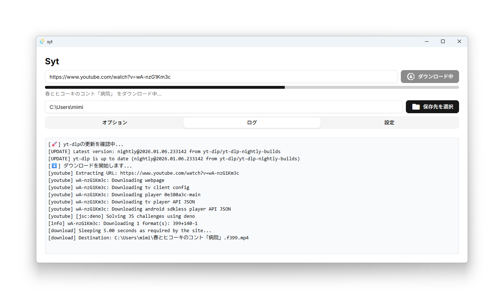
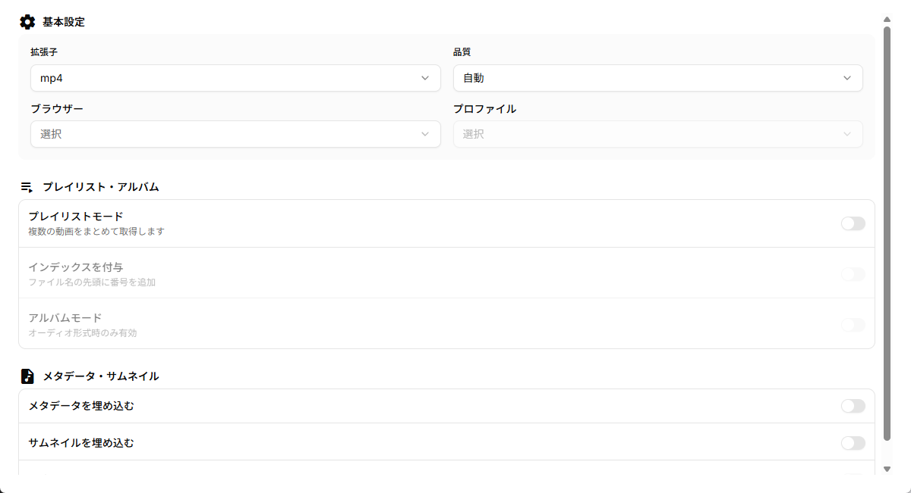
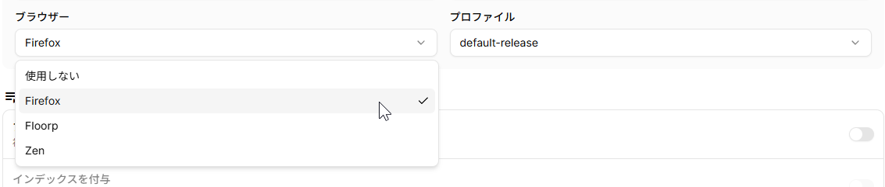

## sytとは

sytは私が開発しているyt-dlpを簡単に扱えるようにするためのデスクトップアプリケーションです。

## スクリーンショット





## 機能

### 動画のダウンロード

もちろん、動画をダウンロードすることが可能です。

### オプション



拡張子、品質、プレイリストモード(後述)、アルバムモード(後述)、メタデータ・サムネイルの埋め込みを簡単に設定できます。

### プレイリストモード

プレイリストモードはプレイリストをダウンロードする際に適した設定です。  
プレイリストの名前でフォルダを作成し、その中にファイルを保存します。

また「インデックスを付与」を有効にすることで、ファイル名の先頭にインデックスを付与します。

### アルバムモード

YouTube Musicからダウンロードする際に適した設定です。  
拡張子が音声の時のみ有効にでき、アルバムの名前でフォルダを作成し、その中にファイルを保存するのはもちろん、  
メタデータのパース、サムネイルを1:1にクロップして埋め込むなど、音楽ファイルに適した処理を施します。

### ブラウザプロファイルの取得



Firefoxとそのフォークブラウザ(Floorp,Lible,Zen)のプロファイルを取得し、ブラウザのCookieを使用できます。  

これによりログイン状態でダウンロードを行うことができます。

## インストール

https://github.com/monuke-maho/syt/releases/latest

からWindows,macOS向けのインストーラーをダウンロード可能です。

Windowsユーザーであれば`syt_x.x.x_x64-setup.exe`及び`syt_x.x.x_x64_ja-JP.msi`を、  
macOSユーザーであれば`syt_x.x.x_aarch64.dmg`をダウンロードしてください。

### ffmpeg

yt-dlpはffmpegを使用します。  
ffmpegはユーザーがインストールする必要があります。

#### Windows
```bash
winget install Gyan.FFmpeg
```

#### macOS
```bash
brew install ffmpeg
```

## スタック

- [yt-dlp](https://github.com/yt-dlp/yt-dlp)
- [Tauri](https://github.com/tauri-apps/tauri)
- [Vue](https://github.com/vuejs/)
- [Vite](https://github.com/vitejs/vite)
- [TailwindCSS](https://github.com/tailwindlabs/tailwindcss)
- [shadcn-vue](https://github.com/unovue/shadcn-vue)

Tauriを使用しています。  
Rustはほんの少ししか書いてないです。ほぼフロントエンド側から呼び出す形です。

## macOSユーザーへ

リリースページにある`.dmg`ファイルはM1以降のMac向けのみです。  
Intel Macは動作検証が不可能なため、提供していません。

macOSユーザーは通常通り`.app`をアプリケーションフォルダーに移動した後に、以下のコマンドを実行してください。  
署名を行えないため、実行しない場合「壊れている」と表示され実行できません。

```bash
xattr -d com.apple.quarantine /Applications/syt.app
```

お手数をおかけします。

## 終わり

終わりです。ぜひ使ってみて下さい。