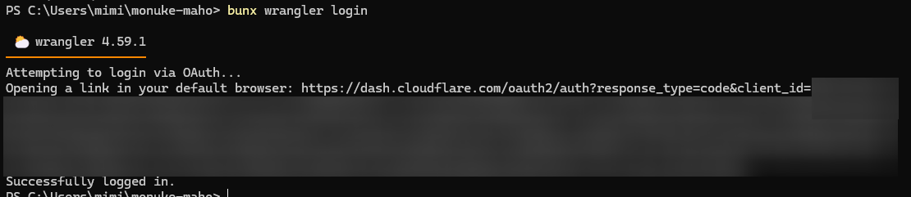
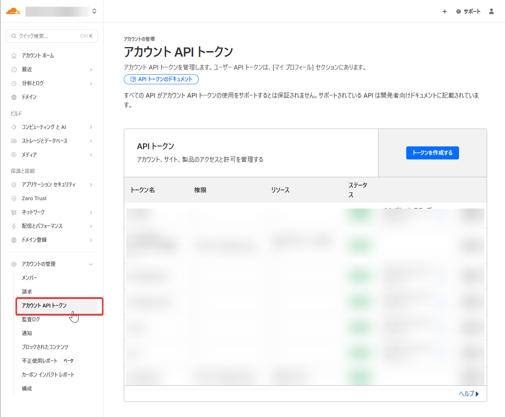
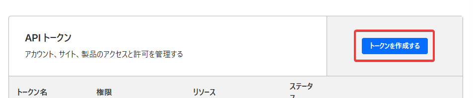
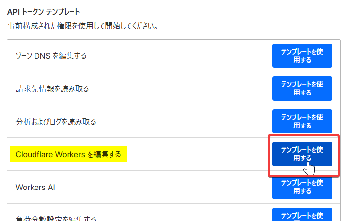
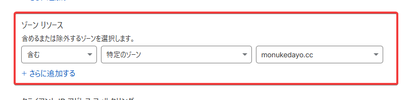
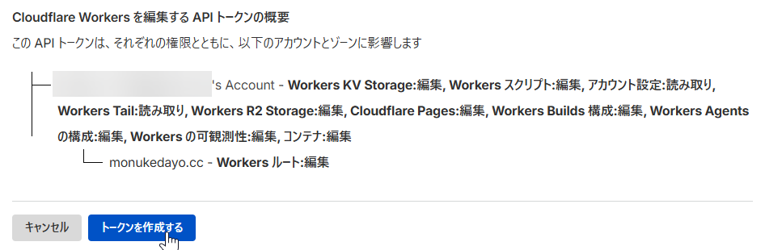
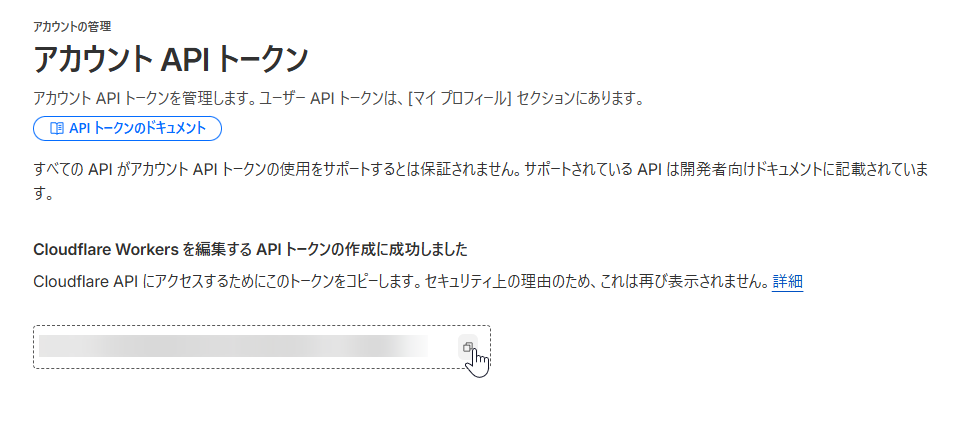
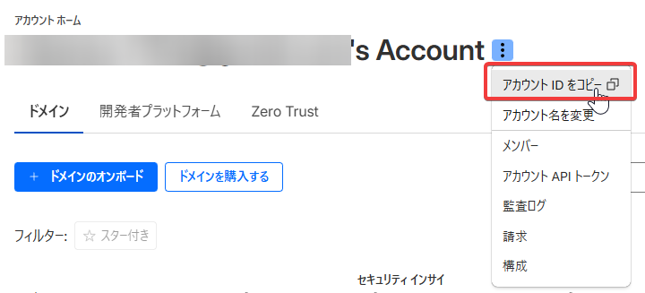

## Cloudflare WorkersとPagesの違い

Workersはエッジコンピューティングのサービスで、Pagesは静的サイトのホスティングを行うサービスです。

Hugoのデプロイ先としてはPagesが使われてきましたが…

## Pagesから移行しよう?

少し前まで、なんですけどねダッシュボードにPagesからWorkersに移行しませんか?っていう表示が出ていました。

正直Pagesの手軽さはとてつもない魅力です。軽いサイトをぺっと公開できますからね。

それを捨ててWorkersに？？

## とても簡単である

移行というより、このブログは元々GitHub Pagesでホスティングする予定でしたが、デプロイがうまく行かなかったため、Cloudflareで公開しています。

Workersで公開するのはとても簡単ですので、やり方を紹介します。

## wrangler.jsoncの作成

プロジェクトのルートに`wrangler.jsonc`を作成します。  
んで内容は以下のように記述します。

```json
{
  "name": "project-name",
  "compatibility_date": "2026-01-15",
  "assets": {
    "directory": "./public"
  },
  "routes": [
    {
      "pattern": "yourdomain.org",
      "custom_domain": true
    }
  ]
}
```

`name`と`compatibility_date`、`routes`の`pattern`は適宜置き換えるように。  
なおカスタムドメインはCloudflareで管理されているものに限ります。

## テストでデプロイ

デプロイには`wrangler`というCloudflare公式のCLIツールを使用します。

### ログイン

```bash
bunx wrangler login
```

実行するとブラウザが立ち上がります。立ち上がらない場合は表示されるURLにアクセスし、ログインしてください。



画像のようになればOK!

### デプロイ

```bash
hugo build --minify
```

まずはhugoをbuildして,

```bash
bunx wrangler deploy
```

を実行するとプロジェクトの作成からデプロイまでやってくれる。

カスタムドメインも設定済みなので、アクセスすれば見れるようになります!

## CIの設定

このブログはGithu Actionsを使用してビルド→デプロイまでされている。  
以下がワークフローファイル。

```yaml
name: Build and Deploy

on:
  push:
    branches:
      - main

defaults:
  run:
    shell: bash

jobs:
  build:
    runs-on: ubuntu-latest
    env:
      TZ: Asia/Tokyo
    steps:
      - name: checkout
        uses: actions/checkout@v6
        with:
          submodules: recursive
          fetch-depth: 0
      
      - uses: oven-sh/setup-bun@v2
      - name: setup hugo
        uses: peaceiris/actions-hugo@v3
        with:
          hugo-version: 'latest'
          extended: true
      
      - name: build
        run: |
          hugo --gc --minify
      
      - name: Deploy
        uses: cloudflare/wrangler-action@v3
        with:
          apiToken: ${{ secrets.CLOUDFLARE_API_TOKEN }}
          accountId: ${{ secrets.CLOUDFLARE_ACCOUNT_ID }}
          wranglerVersion: '4.59.1'
          packageManager: bun
          command: deploy
```

まぁ何の変哲もない。  
wranglerのバージョンを指定しないと古いバージョンを使用するので、できれば指定しておこう。  
あとはbunを使うと実行時間が短くなるので、使ってるくらい。

`apiToken`と`accountId`はそれぞれ

### APIトークンの取得



ダッシュボードのサイドバーのアカウントの管理 → アカウントAPIトークン を開き



トークンを作成する をクリック。



APIトークンテンプレートから「Cloudflare Workersを編集する」のテンプレートを使用する。



ゾーンリソースでドメインを指定して、



トークンを作成します。



表示されたトークンをGithub Actionsのsecretsに追加するだけです。

### アカウントIDの取得



アカウントホームのアカウント名の横の三点リーダーを開いて一番上にアカウントIDをコピーっていうボタンがある。

それをGithub Actionsのsecretsに追加するだけ。

## 実行時間

私のブログはまだ始めて間もないので、規模が小さい。それ故実行時間は概ね20~30秒で収まっている。

もう少し規模が大きくなれば伸びるだろうけど、それでも大した時間にはならないのでは？

## 終わり

以上です。こういう使い方もCloudflareが提示しているやり方です。  
この使い方ではWorkersのリソースを消費しません。リクエストの無料枠を消費しないってことです。嬉しい。

表示速度も体感できるほどの差は無いので、どちらか好きな方を選べばいいと思います。