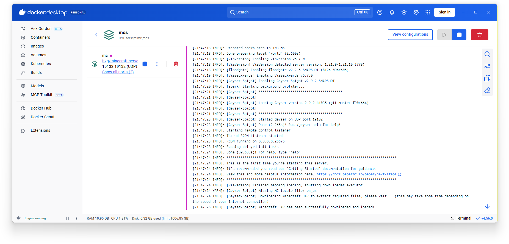

## マイクラサーバー

Minecraftサーバーって一度は立ててみたいと思うんじゃないでしょうか？  
え？思わない…。そうですか。

その難易度自体あまり高くありません。javaをインストールして、サーバーのjarファイルを起動するだけですから、極端な話

```bash
sudo apt update
sudo apt install openjdk-21-jre
mkdir server
cd server
wget https://fill-data.papermc.io/v1/objects/f3f6bb1f913bd977da65edaec79ec94ced7c7971352d8630eddf782d6af0f03c/paper-1.21.11-92.jar
mv paper-1.21.11-92.jar server.jar
echo "EULA=true" >> eula.txt
java -Xmx8G -Xms8G -jar server.jar nogui
```

で立てれてしまいます。簡単ですね。

## Dockerで

Dockerで構築できると何が良いか。環境の再現が容易なので、再構築が簡単になります。  
compose.yamlとかをGitHubで管理してあげれば、ワールドデータなどのバックアップがあればマシンの移行とかも簡単です。

そういうのが魅力です。

## やってみよう!

まず適当なディレクトリを作成します。

```bash
mkdir mcs
cd mcs
```

その中に`compose.yaml`を作成します。  
内容は以下の通り。

```yaml
services:
  mc:
    image: itzg/minecraft-server:latest
    pull_policy: daily
    tty: true
    stdin_open: true
    ports:
      - 25565:25565
    environment:
      TZ: "Asia/Tokyo"
      USE_AIKAR_FLAGS: "TRUE"
      EULA: "TRUE"
      MEMORY: "8G"
      TYPE: "PURPUR"
      VERSION: "1.21.10"
    volumes:
      - ./data:/data
```

色々書いてあります。説明をしよう簡単にね。

`image`はそのとおり、使用するイメージです。  
itzgさんのイメージが簡単でおすすめ。





`tty`と`stdin_open`は`true`にする。コマンドを受け付けるため。

`ports`は適宜変更があるかもしれない。`25565:25565`は最も一般的。

`environment`に関しては

- `TZ`  
    タイムゾーン。日本時刻にしている。

- `USE_AIKAR_FLAGS`  
    Aikar's flagsを使用するかどうか。  
    プラグインサーバーなどでは推奨されているため、有効にする。

- `EULA`  
    MojangのEULAに同意するかどうか。  
    これを`TRUE`にしないと起動しない。(`eula.txt`の書き換えを行わない限り)

- `MEMORY`  
    割当メモリ。プラグインサーバーは8GBくらいから割り当てる。  
    規模によってことなるけど人数を入れるなら16とか32は必要になってくる。

- `TYPE`  
    サーバーソフトウェアを指定する。今回は`PURPUR`。  
    `VANILLA`がバニラ、`PAPER`がPaperMCって感じ。その他も指定できる。

- `VERSION`  
    マインクラフトのバージョンを指定する。  
    今回は`1.21.10`を。

`volumes`は`./data`にワールドデータや設定ファイルなどを保存するようにしている。

## 起動

```bash
docker compose up -d
```

で起動する。至って普通だね。

今回はWindows環境のため、Docker Desktopを確認すると…



起動できてますね!!

## プラグインの導入

プラグインは`compose.yaml`の`environment`に記述することで勝手にダウンロードしてくれる。

```yaml
      PLUGINS: |
        https://github.com/ViaVersion/ViaVersion/releases/download/5.7.0/ViaVersion-5.7.0.jar
        https://github.com/ViaVersion/ViaBackwards/releases/download/5.7.0/ViaBackwards-5.7.0.jar
        https://download.geysermc.org/v2/projects/geyser/versions/latest/builds/latest/downloads/spigot
        https://download.geysermc.org/v2/projects/floodgate/versions/latest/builds/latest/downloads/spigot
```

みたいな感じで。反映するためには

```bash
docker compose down
```

してからもう一度

```bash
docker compose up -d
```

立ち上げる必要がある。

## おわり

まぁこんな感じです。ワールドデータなどのバックアップを取っておけば、どの環境でも簡単に再構築が可能なのはとてもいいですね。

以上ｯ!!!!!!!!!!!!!