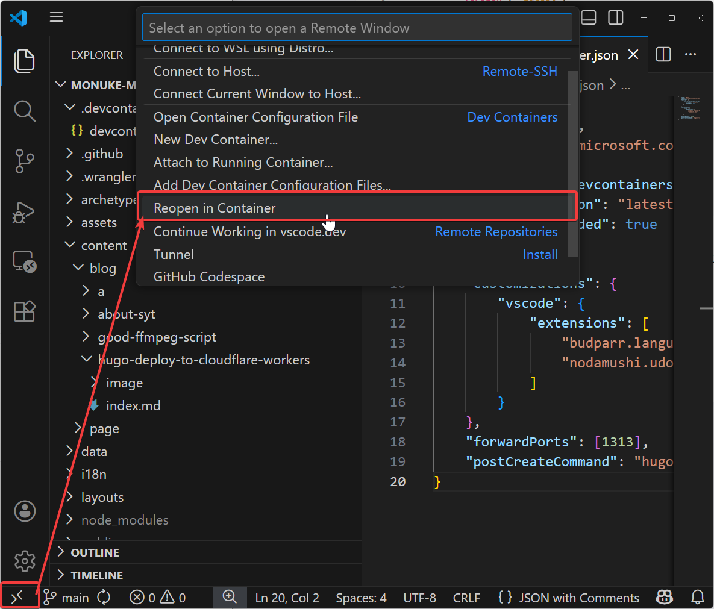

## Devcontainer

開発環境をDockerコンテナとしてパッケージ化する仕組みです。  
環境を刷新しても簡単に環境を構築できるのが強みだそうです。

ローカル環境も汚さないのでそこもメリット、OSが違ってもコンテナ内はLinux環境になるため、OSによる差異も減らせます。

あとはまぁGitHubのCodespaceで執筆できるようになるので、メリットは大きいと思います。

## 使い方

### `.devcontainer/devcontainer.json`を作成する

`.devcontainer`ディレクトリの中に`devcontainer.json`を作成して、以下の内容を記述する。

```json
{
    "name": "Hugo",
    "image": "mcr.microsoft.com/devcontainers/base:ubuntu",
    "features": {
        "ghcr.io/devcontainers/features/hugo:1": {
            "version": "latest",
            "extended": true
        }
    },
    "customizations": {
        "vscode": {
            "extensions": [
                "budparr.language-hugo-vscode",
                "nodamushi.udon"
            ]
        }
    },
    "forwardPorts": [1313],
    "postCreateCommand": "hugo version"
}
```

私の環境では依存関係が全然無いのでこんな感じでスッキリとしているが、テーマの中にはnodejsが必要だったりgoが必要だったりするので、そこは適宜…ね？

### devcontainerを開く



左下にある「><」をクリックし、「Reopen in Container」をクリックします。

あとは起動するのを待つだけです。

## 終わり

こんな感じです。使いにくいですが一応ブラウザから執筆できるようになりましたね。  
WindowsとLinux,macOSでパスの仕組みが微妙に異なるのでそれに悩まされることも無くなりました。

コンテナに苦手意識がありますが、使ってみないとね。